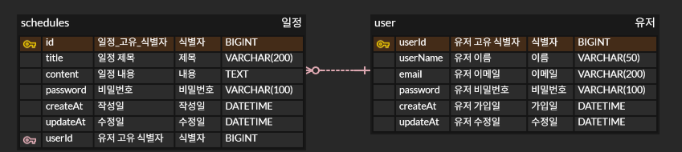

# 일정 관리 앱 Develop

## ERD


## API 명세서 작성

### 일정 API 명세서
|    기능    | Method |          URL          |                    Request                     |                                            Response                                             | 상태 코드          |
|:--------:|:------:|:---------------------:|:----------------------------------------------:|:-----------------------------------------------------------------------------------------------:|----------------|
|  일정 등록   |  POST  |   ```/schedules```    | ```userId```<br> ```title```<br> ```content``` | ```id```<br>```userId```<br> ```title```<br> ```content```<br> ```createAt```<br>```updateAt``` | 201 Created    |
| 일정 전체 조회 | GET |   ```/schedules```    |                      none                      | ```id```<br>```userId```<br> ```title```<br> ```content```<br> ```createAt```<br>```updateAt``` | 200 OK         |
| 일정 단건 조회 | GET | ```/schedules/{id}``` |                      none                      | ```id```<br>```userId```<br> ```title```<br> ```content```<br> ```createAt```<br>```updateAt``` | 200 OK         |
|  일정 수정   | PATCH  | ```/schedules/{id}``` |          ```title```<br>```content```          |  ```id```<br>```userId```<br> ```title```<br> ```content```<br> ```createAt```<br>```updateAt```   | 200 OK         |
|  일정 삭제   | DELETE | ```/schedules/{id}``` |                      none                      |                                              none                                               | 204 No Content |        

| Path Variable  |  type   |  Description  |
|:--------------:|:-------:|:-------------:|
|       id       | number  | 일정의 고유 ID |

## 유저 API 명세서
|    기능     | Method |         URL         |                   Request                    |                                     Response                                      |      상태      |
|:---------:| :---: |:-------------------:|:--------------------------------------------:|:---------------------------------------------------------------------------------:|:------------:|
|   회원가입    | POST | ```/users/signup``` | ```userName```<br>```email```<br>```password``` | ```userId```<br>```userName```<br>```eamil```<br>```createAt```<br>```updateAt``` | 201 Created  |
|    로그인    | POST | ```/users/login```  |  ```email```<br>```password``` |                           ```Set-Cookie: JSESSIONID```                            |    200 OK    | 
| 유저 전체 조회  | GET |      ```/users```      | none |   ```userId```<br>```userName```<br>```email```<br>```createAt```<br>```updateAt```   |    200 OK    |
| 유저 단 건 조회 | GET | ```/users/{userId}``` | none |   ```userId```<br>```userName```<br>```email```<br>```createAt```<br>```updateAt```   |    200 OK    |
|   유저 수정   | PATCH | ```/users/{userId}``` | ```userName```<br>```email```<br>```password``` | ```userId```<br>```userName```<br>```email```<br>```createAt```<br>```updateAt``` |    200 OK    |
|   유저 삭제   | DELETE | ```/users/{userId}``` | none | none | 204 No Count | 


|  Path Variable  |  type   | Description  |
|:---------------:|:-------:|:------------:|
|     userId      | number  | 유저의 고유 ID |